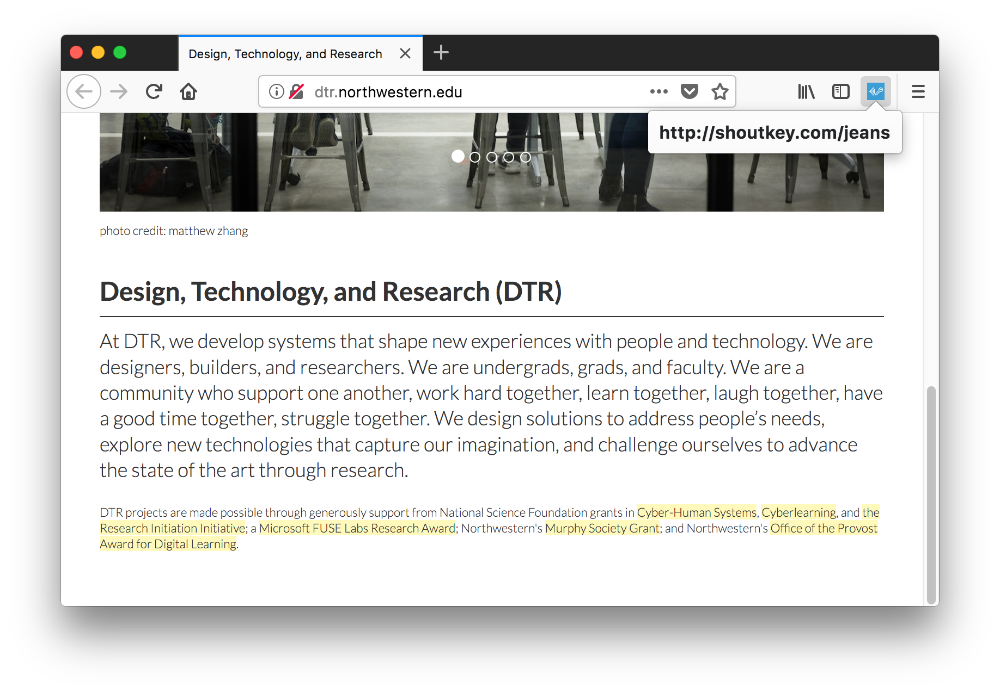

# yellkey-extension

Adds a button to the browser toolbar to quickly generate a [YellKey](http://yellkey.com) for the current page. A YellKey is a one-word, easy-to-pronounce URL with 5-minute lifetime (when generated through this extension).

Working on Firefox 57 and newer, and Chrome 63 and newer.

YellKey is inspired by ShoutKey, which was closed down around January 2018.

## Download

| **Firefox** | (addons.mozilla.org)[https://addons.mozilla.org/en-US/firefox/addon/shoutkey/] |
| **Chrome** | (Chrome Web Store)[https://chrome.google.com/webstore/detail/yellkey/ieommihkmkcmgfendkgijmpleeoajdhi?hl=en-US&gl=US] |

## See also

Based on the [ShoutKey Chrome and Safari Extension](https://github.com/NUDelta/shoutkey-extension).

